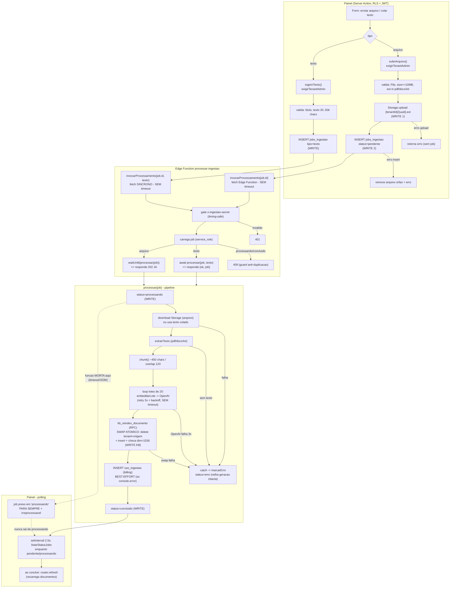

# Fluxo Crítico — Ingestão de Documento (ponta a ponta)

> Rastreado do código real (nada presumido): `conhecimento/acoes.ts`, `lib/ingestao.ts`,
> Edge Function `processar-ingestao/index.ts`, `kb_reindex_documento` (migration 14),
> polling em `conhecimento/componentes.tsx`. Data: 2026-08-04.

Este é o fluxo que alimenta o conhecimento do agente. Tem **duas variantes**: **arquivo**
(assíncrono, background) e **texto colado** (síncrono). Ambas convergem no mesmo pipeline.

## Diagrama do fluxo REAL

## Etapas (ordem de execução)

| # | Arquivo:função | Lê / Escreve | Validação / permissão | Externo | Se falhar | Estado após falha |
|---|---|---|---|---|---|---|
| 1 | `conhecimento/acoes.ts:40` `subirArquivo` | escreve Storage + `jobs_ingestao` | `exigirTenantAdmin` (JWT); ext∈{pdf,docx,txt}; ≤10MB | — | erro de upload → retorna sem job; erro de job → **remove arquivo órfão** | Consistente |
| 1b | `conhecimento/acoes.ts:107` `ingerirTexto` | escreve `jobs_ingestao` | `exigirTenantAdmin`; texto 20–50k | — | retorna erro | Job `pendente` fica se o invoke falhar (ver F4) |
| 2 | `lib/ingestao.ts:16` `invocarProcessamento` | — | segredo `INGESTAO_SECRET` (server-only) | **fetch Edge Function (SEM timeout)** | arquivo: marca job `erro`; texto: retorna erro | Arquivo consistente; texto pode ficar órfão (F4) |
| 3 | `index.ts:321` handler HTTP | lê `jobs_ingestao` (service_role) | gate `x-ingestao-secret` timing-safe; **409 se já processando/concluído** (anti-duplicação) | — | 401/400/404/409 | Consistente |
| 4 | `index.ts:215` `processar` | escreve status/progresso | — (roda como service_role, `tenant_id` vem do job) | Storage download; OpenAI | `catch` → `marcarErro` | Ver F1 (morte da função) |
| 5 | `index.ts:167` `embeddarLote` | — | valida 1536 dims | **OpenAI (retry 3x + backoff, SEM timeout/req)** | após 3 tentativas → throw → job `erro` | Consistente (reprocessável) |
| 6 | migration 14 `kb_reindex_documento` | escreve `kb_documentos` | tenant ativo; dim=1536; sobrescreve `metadata.tenant_id` | — | `raise` → rollback | **Atômico**: geração antiga preservada |
| 7 | `index.ts:279` `uso_ingestao` insert | escreve billing | — | — | `console.error`, **não derruba** | ⚠️ Doc indexado mas **uso não registrado** (F2) |
| 8 | `componentes.tsx:78` polling | lê `jobs_ingestao` | `exigirTenantAdmin` | — | — | Poll infinito se job travar (F1) |

## Respostas

**Etapas não atômicas / risco de inconsistência**
- A sequência do painel (Storage → job → invoke) **não é transação única**, mas cada falha é tratada (órfão limpo; invoke falho → job `erro`). Consistente na prática.
- O **swap (etapa 6) É atômico** — delete+insert+checagem numa transação; falha faz rollback e preserva a geração anterior. ✅
- **`uso_ingestao` (etapa 7) é best-effort**: se falhar após um swap bem-sucedido, o documento fica indexado mas **o consumo de tokens de embedding não é cobrado** → billing subestimado, sem sinal ao usuário. Inconsistência de **billing** (não de dado).
- **Progresso `chunks_ok`** é escrito fora da transação do swap — cosmético (barra), não integridade.

**Ponto de não-retorno / usuário preso**
- **SIM — job preso em `processando` (F1).** Se a função for morta (timeout/OOM) **depois** de setar `processando` e **antes** do swap/`erro`, o `catch` não roda. O job fica `processando` para sempre, o painel faz polling infinito, **e não dá para reprocessar**: o handler devolve **409** ("já está processando") e o `reprocessar` do app também barra status `processando`. O documento nunca aparece e **só sai desse estado com intervenção manual no banco**. Não perde acesso à conta, mas o recurso fica travado.

**Race condition (dois atores simultâneos)**
- **Duplo invoke do MESMO job:** o guard 409 mitiga, mas há janela TOCTOU (dois invokes leem `pendente` antes de qualquer um setar `processando`) → ambos processam → **duplo custo OpenAI + duplo `uso_ingestao`**. O swap serializa (locks de linha por `origem`) e não gera chunk duplicado. Probabilidade baixa (duplo clique / re-entrega de webhook).
- **Duplo submit de upload:** gera **dois jobs com `origem` diferentes (uuid)** → **dois documentos duplicados** na KB (sem dedup). Probabilidade média (duplo clique).

**Dependência externa sem plano B**
- **OpenAI (embedding)** — tem mini-plano B (retry 3x + backoff); se cair de vez → job `erro`, reprocessável. Sem provedor alternativo (aceitável).
- **Edge Function** — invoke **sem timeout** no app; no caminho **texto (síncrono)** uma Edge lenta pendura a Server Action até o timeout da plataforma. Sem circuit breaker.
- **Storage download** — sem retry; falha → job `erro`.

**Validação só no client não reforçada no servidor**
- **Nenhuma.** O `accept=".pdf,.docx,.txt"` do input é só dica; `subirArquivo` **revalida extensão e tamanho no servidor**, o bucket tem `allowed_mime_types` + `file_size_limit`, e o tamanho do texto é validado no servidor. Tudo reforçado. ✅
- Ressalva menor: o content-type é derivado da **extensão**, não dos bytes reais (magic) — um arquivo renomeado passa, mas `extrairTexto` falha e o job vira `erro` (sem impacto de segurança).

## Pontos frágeis (severidade + correção)

| ID | Fragilidade | Sev | Correção sugerida |
|---|---|---|---|
| **F1** | Job preso em `processando` (função morta) + **irreprocessável** (409 / guard) | **Alta** | `iniciado_em` no job + reaper que marca `erro` jobs `processando` há > N min; permitir reprocessar job "processando velho". |
| **F2** | `uso_ingestao` best-effort → billing subestimado silencioso | **Média** | Registrar o uso na MESMA transação do swap (ou fila de retry), não best-effort. |
| **F3** | Invoke da Edge Function **sem timeout** (caminho texto trava a action) | **Média** | `AbortSignal.timeout` no `invocarProcessamento`; mover texto para o caminho assíncrono (job + polling). |
| **F4** | `ingerirTexto`: falha de rede deixa job `pendente` órfão (não marca `erro`) | **Baixa** | Marcar `erro` no `!r.ok`, como faz o `subirArquivo`. |
| **F5** | Duplo submit gera documentos duplicados (sem dedup por conteúdo/arquivo) | **Baixa** | Desabilitar botão enquanto pendente (já há `pendente` state) + dedup por hash de arquivo, se quiser. |
| **F6** | Race de duplo-invoke → duplo custo OpenAI/billing (janela TOCTOU no guard 409) | **Baixa** | `SELECT ... FOR UPDATE` no job antes de setar `processando`, ou advisory lock por `job_id`. |
| **F7** | OpenAI/Storage sem timeout por request (têm retry) | **Baixa** | `AbortSignal.timeout` por tentativa. |

### O que está robusto (não é frágil)
Swap atômico com preservação da geração antiga; limpeza de arquivo órfão; retry+backoff na OpenAI; guard 409 anti-duplicação; validação reforçada no servidor; `tenant_id` sempre do job/JWT (nunca do request); invariante `metadata.tenant_id` reescrito pela função de swap.

### Nota de método
Fluxo lido dos arquivos reais e do corpo das funções no banco (não inferido de nomes).
Não executei falhas em produção; os caminhos de erro vêm da leitura dos `try/catch` e das
transações. Nada foi alterado.
